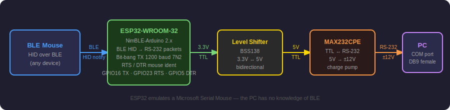
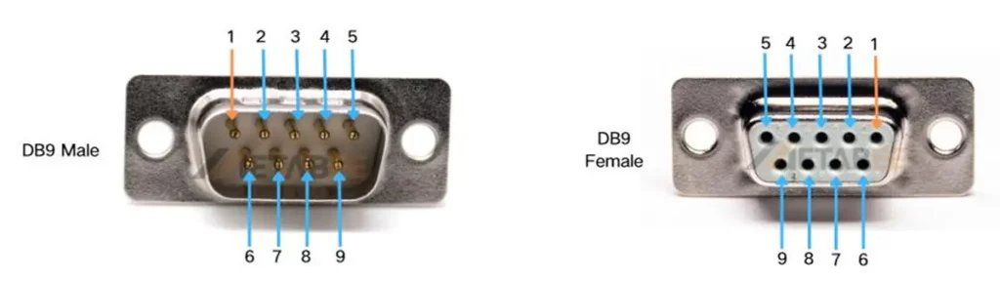
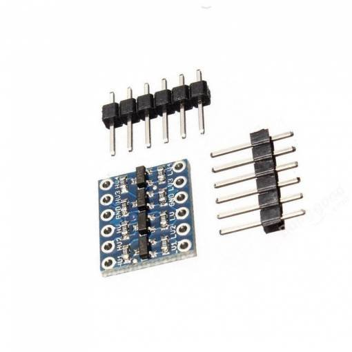
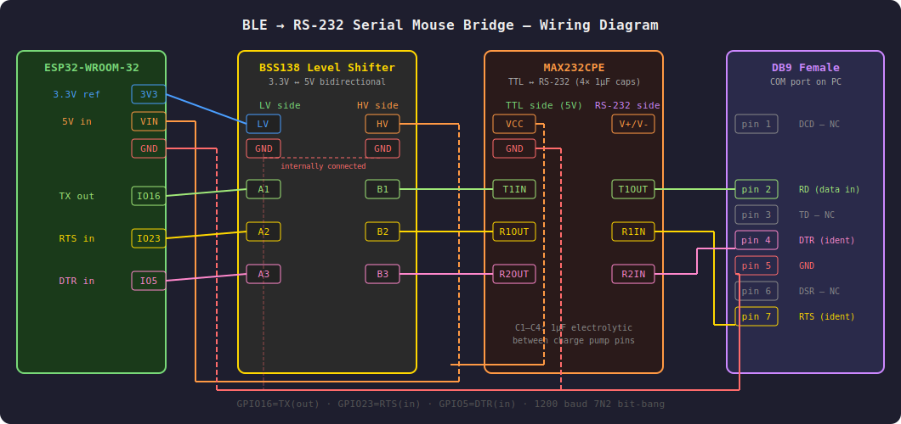

# BLE → RS-232 Serial Mouse Bridge

> ESP32 firmware that acts as a **Microsoft Serial Mouse emulator** — connects to any BLE HID mouse and forwards movement, buttons and scroll wheel to a PC via the RS-232 serial port.

Ideal for retro PCs, Socket 7 / 486 / 386 machines or any device with a DB9 serial COM port that you want to use with a modern wireless mouse.

---

## Block Diagram



---

## Features

- **BLE HID host** — connects to any Bluetooth LE mouse (NimBLE-Arduino 2.x)
- **RS-232 serial mouse emulator** — bit-bang TX with precise timing via `esp_timer_get_time()`
- **High-DPI scaling** — configurable divisor for modern mice (400–3200 DPI)
- **Scroll wheel** — forwarded to PC via IntelliMouse `MZ` protocol (requires ctmouse ≥ 3.4)
- **Sub-pixel accumulator** — motion remainder preserved between packets for smooth movement
- **RTS / DTR identification** — responds to either signal for maximum driver compatibility; ISR stops movement data instantly on RTS edge to prevent packet corruption during detection
- **Scan-before-connect** — waits for mouse to start advertising before connecting
- **Persistent pairing** — `connect` retries up to 20 times automatically; keep mouse in pairing mode until connected
- **Auto-reconnect** — BLE daemon task detects disconnection and reconnects automatically
- **Battery level** — reads mouse battery percentage via BLE daemon task (off-loop, never blocks ident response)
- **NVS storage** — paired mouse and all settings remembered across reboots
- **Serial console** — full command interface at 115200 baud
- **WiFi disabled** — WiFi stack is deinitialised at startup, saving ~20 mA

---

## Hardware

### Components

| Component | Description |
|-----------|-------------|
| ESP32-WROOM-32 | Main microcontroller |
| BSS138 bidirectional level shifter | 3.3 V ↔ 5 V logic translation |
| MAX232CPE | TTL ↔ RS-232 level converter |
| 4× 1 µF electrolytic capacitor | Charge pump capacitors for MAX232 |
| DB9 female connector | Serial port — connects to PC COM port |

### Connectors

#### DB9 Female (RS-232 COM port)



| Pin | Signal | Direction | Description |
|-----|--------|-----------|-------------|
| 1 | DCD | — | Not connected |
| 2 | RD | ← ESP32 | Serial data from bridge to PC (mouse data) |
| 3 | TD | — | Not connected |
| 4 | DTR | → ESP32 | PC asserts to reset/identify mouse (GPIO5) |
| 5 | GND | — | Signal ground |
| 6 | DSR | — | Not connected |
| 7 | RTS | → ESP32 | PC asserts to reset/identify mouse (GPIO23) |
| 8 | CTS | — | Not connected |
| 9 | RI | — | Not connected |

> ⚠️ **Note:** Only 3 signal wires are required: **pin 2** (RD), **pin 5** (GND), and at least one of **pin 4** (DTR) or **pin 7** (RTS). Most DOS mouse drivers use DTR, RTS or both for identification.

> ⚠️ **MAX232 polarity:** The MAX232 receiver inverts RS-232 levels to TTL. RS-232 asserted (+12V) becomes GPIO **LOW**. The firmware detects the **FALLING** edge as the identification trigger.

### Level Shifter



The BSS138-based bidirectional level shifter translates between ESP32's 3.3 V GPIO and the 5 V TTL side of the MAX232. It has built-in pull-up resistors on both sides — **no external resistors needed**. The LV GND and HV GND are connected internally on the module.

The module has two sides:
- **LV side** — connect to ESP32 (3.3 V logic)
- **HV side** — connect to MAX232 TTL pins (5 V logic)

### MAX232CPE

The MAX232CPE converts between 5 V TTL (from the level shifter) and RS-232 voltage levels (±12 V) required by the serial port.

It requires **4 external 1 µF electrolytic capacitors** connected between its charge pump pins (C1+/C1−, C2+/C2−, VS+, VS−). Refer to the MAX232 datasheet for exact placement.

---

### Wiring Diagram



#### Step-by-step connections

**ESP32 → Level Shifter (LV side)**

| ESP32 pin | Level Shifter LV | Signal |
|-----------|-----------------|--------|
| 3V3 | LV | 3.3 V reference |
| GND | GND | Common ground |
| GPIO16 | A1 | TX (data out to MAX232) |
| GPIO23 | A2 | RTS input (from MAX232) |
| GPIO5 | A3 | DTR input (from MAX232) |

**Level Shifter (HV side) → MAX232**

| Level Shifter HV | MAX232 pin | Signal |
|-----------------|-----------|--------|
| HV | VCC | 5 V power |
| GND | GND | Common ground |
| B1 | T1IN | TX data → RS-232 transmitter |
| B2 | R1OUT | RTS TTL output from RS-232 receiver |
| B3 | R2OUT | DTR TTL output from RS-232 receiver |

**MAX232 → DB9 Female**

| MAX232 pin | DB9 pin | Signal |
|-----------|---------|--------|
| T1OUT | pin 2 (RD) | Serial data to PC |
| R1IN | pin 7 (RTS) | RTS line from PC |
| R2IN | pin 4 (DTR) | DTR line from PC |
| GND | pin 5 (GND) | Signal ground |

**Power**

| Source | Destination | Note |
|--------|------------|------|
| External 5 V | ESP32 VIN | Powers the ESP32 and the HV side |
| ESP32 VIN | Level Shifter HV | 5 V rail |
| ESP32 VIN | MAX232 VCC | 5 V rail |
| ESP32 3V3 | Level Shifter LV | 3.3 V reference |

> 💡 **Why a level shifter?** The MAX232 TTL side operates at 5 V. ESP32 GPIO is 3.3 V tolerant max. Connecting directly risks damaging the ESP32. The BSS138 level shifter safely translates between the two voltage levels bidirectionally.

> 💡 **Bit-bang timing:** The firmware uses `taskENTER_CRITICAL` + `esp_timer_get_time()` for precise 833 µs bit timing, blocking FreeRTOS/BLE interrupts for the duration of each byte to prevent framing errors on the PC UART.

---

## Software

### Requirements

| Tool | Version |
|------|---------|
| Arduino IDE | 2.x |
| ESP32 Arduino core | ≥ 3.x |
| NimBLE-Arduino | ≥ 1.4.2 |

### Installation

1. Install **ESP32 Arduino core** via Boards Manager
2. Install **NimBLE-Arduino** via Library Manager
3. Open `ble_serial_mouse_bridge.ino` in Arduino IDE
4. Select board: **ESP32 Dev Module**
5. Upload

### Configuration

Pin assignments at the top of the sketch:

```cpp
#define TX_PIN   16   // bit-bang TX → MAX232 T1IN → DB9 pin 2
#define RTS_PIN  23   // input: DB9 pin 7 → MAX232 R1OUT → GPIO23
#define DTR_PIN   5   // input: DB9 pin 4 → MAX232 R2OUT → GPIO5
```

Set `DTR_PIN` to `-1` if DTR is not wired.

---

## Usage

Connect via **Serial monitor at 115200 baud**.

### First-time pairing

```
scan                          # scan BLE HID devices for 10 seconds
  #1   db:81:f4:bb:6b:5d  Mouse   -71 dBm  MX Master 3

connect db:81:f4:bb:6b:5d    # connect and save
```

`connect` retries automatically (up to 20 attempts with 500 ms between each). **Keep the mouse in pairing mode** until you see `[NVS] Saved`. Press any key in the Serial Monitor to abort.

### Commands

| Command | Description |
|---------|-------------|
| `scan` | Scan BLE HID devices for 10 s, show MAC / type / RSSI / name |
| `connect <mac>` | Connect to MAC address, retry until success (max 20 attempts), save to NVS |
| `forget` | Erase saved mouse and ALL settings, reset to defaults |
| `proto <M\|M3\|MZ>` | Set serial mouse protocol (saved to NVS) |
| `scale <1-64>` | Set movement divisor for DPI scaling (saved to NVS) |
| `flipy` | Toggle Y-axis inversion (saved to NVS) |
| `flipw` | Toggle scroll wheel inversion (saved to NVS) |
| `reportid <0-255>` | Set BLE HID Report ID filter (saved to NVS) |
| `testm` | Manually send identification sequence |
| `status` | Show connection state and all settings |
| `help` | Show command reference |

### Protocol selection

| Protocol | Ident | Bytes | Frame | Features | Recommended for |
|----------|-------|-------|-------|----------|-----------------|
| `M` | `'M'` | 3 | 7N2 | Left + Right button | Maximum compatibility |
| `M3` | `'M3'` | 4 | 7N2 | + Middle button | Logitech-aware drivers |
| `MZ` | `'MZ'` | 4 | 7N2 | + Scroll wheel + Middle | **ctmouse ≥ 3.4** (default) |

After changing the protocol, reload the mouse driver on the PC. For `ctmouse`:
```
CTMOUSE /U    (unload)
CTMOUSE       (reload)
```

### Scale setting

| Mouse DPI | Recommended scale |
|-----------|-------------------|
| 400 DPI | 1–2 |
| 800 DPI | 2–3 |
| 1600 DPI | 4–6 |
| 3200 DPI | 8–12 |

> 💡 **ctmouse sensitivity:** In addition to `scale`, ctmouse 1.9 supports the `/R` switch to adjust cursor sensitivity on the PC side:
> ```
> CTMOUSE /R3        ← both axes sensitivity 3
> CTMOUSE /R4V2      ← horizontal 4, vertical 2
> ```
> Values 1–9 (0 = auto). `scale` in the bridge and `/R` in ctmouse are independent — use `scale` to match DPI, `/R` to tune feel.

### NVS storage

All settings survive a power cycle. The following values are stored:

| Key | Default | Command |
|-----|---------|---------|
| `mac` | — | `connect` |
| `type` | 1 | `connect` |
| `proto` | MZ (2) | `proto` |
| `scale` | 4 | `scale` |
| `flipy` | false | `flipy` |
| `flipw` | false | `flipw` |
| `reportid` | 0 | `reportid` |

`forget` clears all keys and resets every value to its default.

### Boot status output

On every boot the firmware prints the current NVS configuration before the help text:

```
[NVS] Saved mouse: db:81:f4:bb:6b:5d
[NVS] proto=MZ  scale=1/4  flipy=off  flipw=off  reportid=0
```

### Status output

```
── Status ─────────────────────────────
  BLE:      CONNECTED
  MAC:      db:81:f4:bb:6b:5e
  Battery:  100%
  Proto:    MZ (wheel)
  Scale:    1/4
  FlipY:    no
  FlipW:    no
  ReportID: 0 (auto)
───────────────────────────────────────
```

### Automatic reconnect

When the mouse disconnects, the firmware starts a BLE scan and waits for the mouse to begin advertising, then connects immediately. A BLE daemon FreeRTOS task monitors the connection independently of the main loop.

---

## Serial Mouse Protocol Implementation

### Identification sequence

When the PC driver initialises the serial port it asserts **DTR** and/or **RTS** (RS-232 +12V → GPIO LOW after MAX232 inversion). The firmware uses a two-stage response:

**Stage 1 — ISR (immediate, Core 0):**
On the falling RTS/DTR edge the ISR fires and immediately sets `g_rtsBlackout = true`. This stops any in-progress movement packet transmission on Core 1 before loop() is even aware of the trigger. The packet send loop checks `g_rtsBlackout` on every iteration and aborts, returning remaining movement to the accumulator.

**Stage 2 — loop() (5 ms debounce, Core 1):**
After 5 ms, loop() verifies the line is still asserted and sends the identification bytes:

| Protocol | Response | Frame | Total RTS→first byte |
|----------|----------|-------|---------------------|
| M | `'M'` (0x4D) | 1200 baud 7N2 | ~30 ms |
| M3 | `'M'` + `'3'` | 1200 baud 7N2 | ~30 ms |
| MZ | `'M'` + `'Z'` | 1200 baud 7N2 | ~30 ms |

After sending, TX stays HIGH (idle/MARK) for 200 ms. The driver scans for extra identification bytes (bit6=0) during this window, finds none, and commits to the detected protocol.

**Spurious trigger suppression:** If both RTS and DTR read idle after the 5 ms debounce (glitch or BLE reconnect noise), the ident is cancelled and blackout is cleared — no bytes are sent.

**loop() priority:** The ident check is the first operation in every loop() iteration. All other operations — `handleSerial()`, reconnect, `processMouseMovement()` — are skipped while `g_rtsBlackout` or `g_rtsIdentify` is set. `Serial.setTimeout(20)` caps any Serial read at 20 ms. Battery keepalive (`readValue()`) runs in `bleDaemonTask` on Core 0 so it can never delay a Core 1 ident response.

### Packet formats

**Microsoft (M) — 3 bytes, 7N2:**

```
Byte 0:  1  LB  RB  Y7  Y6  X7  X6    (bit 6 = sync marker)
Byte 1:  0  X5  X4  X3  X2  X1  X0
Byte 2:  0  Y5  Y4  Y3  Y2  Y1  Y0
```

**Logitech M3 — 4 bytes, 7N2:**

```
Bytes 0–2: same as Microsoft
Byte 3:  0  0  MB  0  0  0  0  0      (bit 5 = middle button)
```

**IntelliMouse MZ — 4 bytes, 7N2:**

```
Bytes 0–2: same as Microsoft
Byte 3:  0  0  MB  0  W3  W2  W1  W0  (bit 5 = MB, bits 3:0 = wheel ±8)
```

### Bit-bang timing

The firmware does not use the hardware UART for RS-232 output. Instead it bit-bangs GPIO16 with precise timing:

```
1200 baud → 1 bit = 833 µs
Frame: START(0) | D0 D1 D2 D3 D4 D5 D6 | STOP(1) STOP(1)
```

`taskENTER_CRITICAL` blocks all FreeRTOS and BLE interrupts during each byte to prevent timing corruption. `esp_timer_get_time()` provides hardware-accurate µs timestamps independent of the scheduler.

### BLE HID report parsing

The firmware auto-detects the BLE mouse report format by payload length:

| Length | Format | Notes |
|--------|--------|-------|
| 3 B | `[btn][dx8][dy8]` | Standard 3-byte |
| 4 B | `[btn][dx8][dy8][wheel]` | Standard 4-byte |
| 5 B | `[btn][dx8][dy8][wheel][hwheel]` | Reference HID format |
| 7 B | `[btn][extra][X_lo][XY_mid][Y_hi][wheel][hwheel]` | **Logitech 12-bit packed** (MX Master 2/3, G502, M650) |

Logitech 12-bit X/Y extraction:
```
X = d[2] | ((d[3] & 0x0F) << 8)   → sign-extend to int16
Y = (d[3] >> 4) | (d[4] << 4)     → sign-extend to int16
```

The Report Reference descriptor (UUID 0x2908) is read for each HID characteristic at connect time. Only `Input` type reports (type byte = 1) are subscribed. `ReportID = 0` (boot protocol) is skipped.

### FreeRTOS architecture

```
Core 0                          Core 1 (Arduino loop)
────────────────────────        ───────────────────────────────
BLE stack (NimBLE)              loop()  — time-critical path:
  └─ notifyCallback()             ├─ [1] RTS/DTR ident (first, always)
       └─ portENTER_CRITICAL      │    ISR sets g_rtsBlackout immediately
            g_accX += dx          │    → stops movement packets instantly
            g_accY += dy          │    → fast-return if blackout active
            g_accW += wheel       ├─ [2] handleSerial() (max 20 ms timeout)
                                  ├─ [3] BLE reconnect / tryConnect
rtsISR / dtrISR (IRAM)            ├─ [4] processMouseMovement()
  g_rtsBlackout = true ←──────    │    └─ aborts if g_rtsBlackout fires
  g_rtsIdentify = true            │         mid-packet
                                  └─ delay(1)

bleDaemonTask (priority 1, Core 0)
  every 3 s:
  ├─ keepalive battery readValue()  ← off loop(), never blocks ident
  └─ scan + reconnect if disconnected
```

---

## Serial debug log reference

The firmware outputs diagnostic messages at 115200 baud. All lines are prefixed with a tag:

### BLE events

| Line | Meaning |
|------|---------|
| `[BLE] Connecting xx:xx:xx:xx:xx:xx ...` | Connect attempt started |
| `[BLE] Connect failed (Nx)` | N-th consecutive failed attempt |
| `[BLE] Bonding OK` | BLE pairing completed |
| `[BLE] handle=0xXXXX  ID=N  Type=1  SUBSCRIBE` | Subscribed to HID input characteristic |
| `[BLE] Connected — N char(s), battery N%` | Fully connected, N HID characteristics found |
| `[BLE] Disconnected.` | Connection lost, reconnect scheduled |
| `[DAEMON] Connection lost — scheduling reconnect...` | Daemon task detected loss |
| `[SCAN] Found — connecting...` | Device seen in BLE scan, connecting now |

### Movement and buttons

| Line | Meaning |
|------|---------|
| `[MOVE] pkts=N X=dx Y=dy W=w btn=LRM` | N RS-232 packets sent in last 500 ms; accumulated X/Y/wheel delta; L/R/M button state |
| `[BTN] L=N R=N M=N` | Button state changed — immediate report |

### Identification

| Line | Meaning |
|------|---------|
| `[IDENT] RTS=ASSERT DTR=ASSERT` | Both lines asserted — valid ident trigger |
| `[IDENT] RTS=ASSERT DTR=idle` | Only RTS asserted — still valid |
| `[IDENT] Cancelled — both lines idle` | Spurious ISR trigger (glitch/noise), no bytes sent |
| `[SERIAL] Ident 'MZ'` | Identification bytes sent to PC |

### Identification timing debug

These lines appear with every ident and show the exact timing of the detection cycle:

| Line | Meaning |
|------|---------|
| `[IDENT-DBG] ISR->loop=Nms  section=S  blackout_start` | Delay from RTS ISR to loop() processing. **Should be ≤ 20 ms.** Section S shows which operation was running when ISR fired (see table below) |
| `[IDENT-DBG] RTS_edge->M=Nms` | Total delay from RTS edge to first byte `'M'` on the wire. **Must be < 200 ms** (ctmouse 1.9 timeout). Typical: 29–30 ms |
| `[SERIAL] Ident 'MZ' (total_delay=Nms)` | Same as above but includes `'Z'` byte send time. Typical: 46–47 ms |
| `[IDENT-DBG] blackout_end at +Nms  pending_RTS=B` | Blackout window ended. `pending_RTS=1` means ctmouse sent another RTS during the 200 ms window — will be processed next |

**Section numbers** in `ISR->loop` debug:

| Section | Operation |
|---------|----------|
| 1 | `handleSerial()` — reading UART command |
| 2 | Scan end handler |
| 3 | BLE disconnect handler |
| 4 | BLE reconnect / `tryConnect()` |
| 5 | *(removed — keepalive moved to daemon)* |
| 6 | `processMouseMovement()` — sending RS-232 packet |

If `ISR->loop` is consistently 5 ms and `RTS_edge->M` is ~30 ms, the ident timing is correct. Values above 150 ms risk ctmouse 1.9 falling back to Mouse Systems mode.

### NVS and config

| Line | Meaning |
|------|---------|
| `[NVS] Saved mouse: xx:xx:xx:xx:xx:xx` | MAC loaded from NVS on boot |
| `[NVS] proto=MZ  scale=1/4  ...` | All settings loaded on boot |
| `[NVS] Saved: xx:xx:xx:xx:xx:xx` | New MAC written to NVS after `connect` |
| `[CFG] Scale 1/N saved.` | Setting changed and persisted |

---

## Tested Drivers

| Driver | Protocol | Result |
|--------|----------|--------|
| ctmouse 1.9 | MZ | ✅ Movement, buttons, scroll wheel |
| ctmouse 3.4+ | MZ | ✅ Movement, buttons, scroll wheel |
| MS MOUSE.COM 8.20 | M, MZ | ✅ Movement, buttons |

---

## Troubleshooting

| Symptom | Cause | Fix |
|---------|-------|-----|
| *Mouse not found* | Ident not received in time | Check RTS/DTR wiring; try `testm` while driver is loading |
| *Mouse found* but cursor doesn't move | Wrong protocol | Try `proto M` then reload driver |
| Cursor moves erratically | Packet desync — wrong baud/framing | Verify MAX232 capacitors; check VCC 5 V on MAX232 |
| Movement reversed | Y axis inverted | Use `flipy` |
| Scroll reversed | Wheel direction | Use `flipw` |
| Cursor moves but very slowly | Scale too high | Try `scale 2` or `scale 1` |
| BLE mouse not found in scan | Mouse not in pairing mode | Put mouse in pairing/discoverable mode first |
| `connect` fails many times | Mouse exits pairing mode too quickly | Keep mouse in pairing mode; firmware retries up to 20 times |
| Connects but no movement data | Wrong Report ID | Check serial log for `[BLE]` lines; set `reportid 17` for MX Master |
| Mouse disconnects frequently | Mouse enters BLE sleep | Firmware reads battery every 3 s via daemon task as keepalive — adjust `KEEPALIVE_MS` if needed |
| Device names missing in scan | — | Fixed: scan uses `onResult` (fires after full advertisement + scan response received) |
| ctmouse detects "Mouse Systems" instead of "Microsoft" | ident bytes arrived too late or mid-packet | Check `[IDENT-DBG] ISR->loop` — must be ≤ 20 ms; check `RTS_edge->M` — must be < 200 ms |
| ctmouse sometimes detects wrong protocol | Spurious RTS trigger (glitch/noise) | Fixed: ISR ignores edges where both RTS and DTR read idle after 5 ms debounce |

---

## Credits & References

- Serial mouse protocol: [Tomi Engdahl — PC Mouse Information](https://courses.cs.washington.edu/courses/cse477/00sp/projectwebs/groupb/PS2-mouse/mouse.html)
- Serial mouse protocol reference: [roborooter.com/post/serial-mice](https://roborooter.com/post/serial-mice/)
- NimBLE-Arduino: [h2zero/NimBLE-Arduino](https://github.com/h2zero/NimBLE-Arduino)

---

## License

MIT
